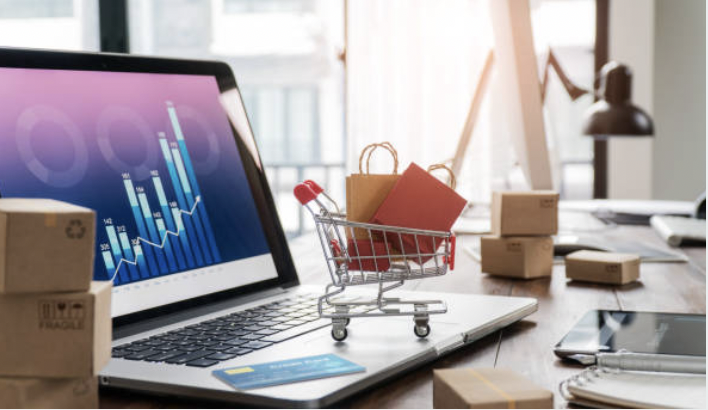
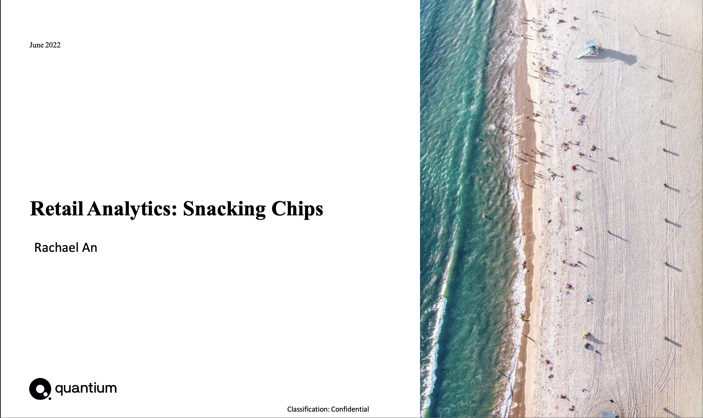
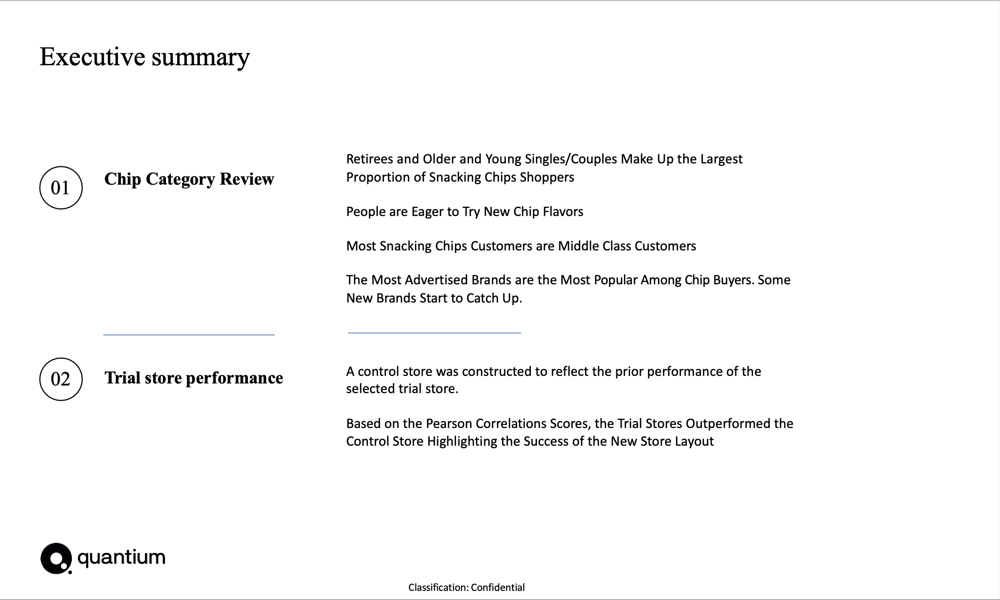
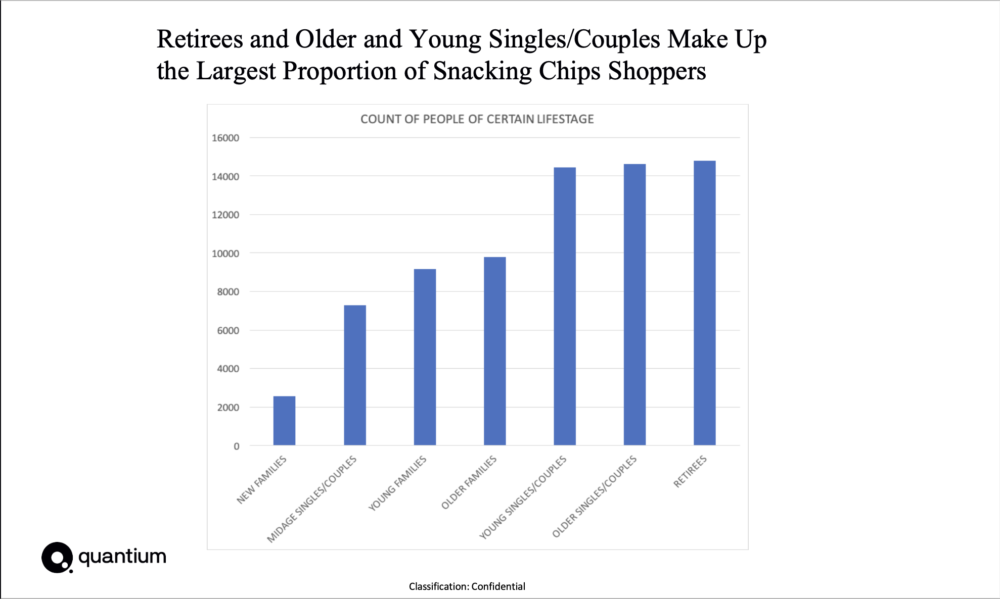
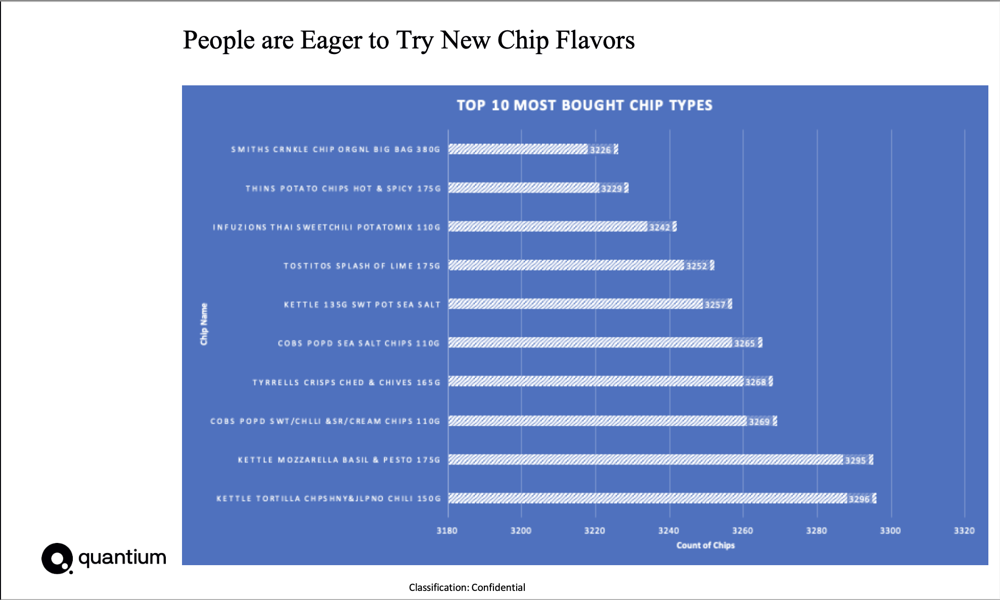
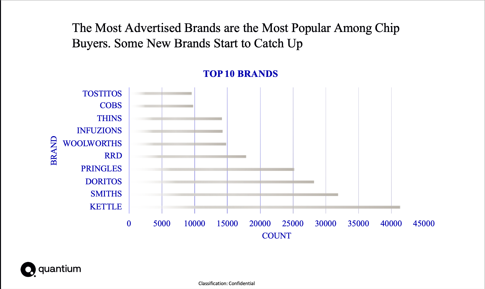
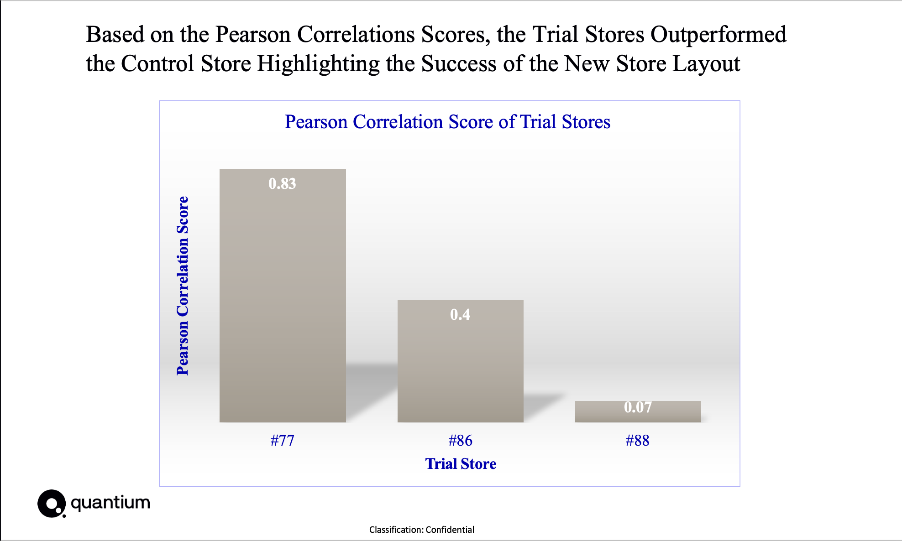
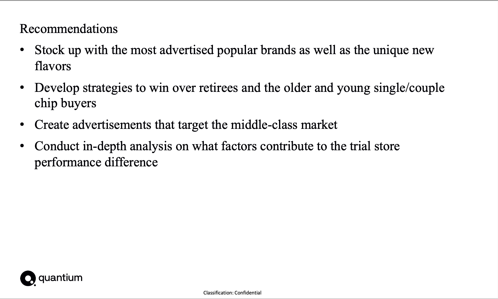

<p align="center">

</p>

> Conduct analysis on the transactional and customer data for a large supermarket brand to generate highly valued insights and provide recommendations to help the business make strategic decisions.

<a name="toc"/></a>
## Table of Contents

1. [Data preparation and customer analytics](#preparation)
    
2. [Experimentation and uplift testing](#experimentation)
 
3. [Analytics and commercial application](#report)

<a name="preparation"/></a>
## 1. Data preparation and customer analytics
[Back to ToC](#toc)

Used Excel to perform the following tasks:
* Examined the transaction and customer data sets and checked for inconsistencies, missing data across the data set and outliers
* Made the necessary changes in the dataset to fix the anomalies
* Merged the transaction and customer data together to prepare the data for analysis
* Created charts and graphs and noted interesting trends or insights

 

<a name="experimentation"/></a>
## 2. Experimentation and uplift testing
[Back to ToC](#toc)

Used Pandas Python data analysis library to perform the following tasks:
* Explored the data and defined metrics for the control store selection 
* Checked each trial store individually in comparison with the control store to get a clear view of its overall performance
* Summarised the findings for each store and provided an recommendation that outlining the impact on sales during the trial period.


```python
import pandas as pd

QVI_PATH = "QVI_data.csv"
QVI_DF = pd.read_csv(QVI_PATH)

store_numbers = QVI_DF.STORE_NBR.unique()
unique_customers = QVI_DF.LYLTY_CARD_NBR.unique()

#dataframe of total sales revenue from each store 
QVI_by_sales_and_customers = QVI_DF.groupby(["STORE_NBR"]).agg(SUM_SALES = ("TOT_SALES", "sum"), NUM_CUSTOMERS = ("LYLTY_CARD_NBR", "count"))
print(QVI_by_sales_and_customers)

#dataframe for number of transactions for each customer
QVI_by_prod_qty = QVI_DF.groupby("LYLTY_CARD_NBR")["PROD_QTY"].sum()
print(QVI_by_prod_qty)

#average number of transactions per customer
print(QVI_by_prod_qty.mean())

#CONTROL STORES: 211, 226
minValueIndexObj = QVI_by_sales_and_customers.idxmin()
maxValueIndexObj = QVI_by_sales_and_customers.idxmax()

#find the min and max sales
min_sales = QVI_by_sales_and_customers["SUM_SALES"].min()
max_sales = QVI_by_sales_and_customers["SUM_SALES"].max()

#Use Pearson correlations as a measure:
#1- (Observed distance – minimum distance)/(Maximum distance – minimum distance)  

#pearson correlations for trial store 77
pearson_correlations_77 = 1 - (3040.00 - min_sales) / (max_sales - min_sales)

#pearson correlations for trial store 86
pearson_correlations_86 = 1 - (10635.35 - min_sales) / (max_sales - min_sales)

#pearson correlations for trial store 88
pearson_correlations_88 = 1 - (16333.25 - min_sales) / (max_sales - min_sales)
```


<a name="report"/></a>      
## 3. Analytics and commercial application
[Back to ToC](#toc)

Used PowerPoint to create the report that presents my insights on who spends on chips and what drives spends for each customer segment and my recommendation in terms of which segments we should be targeting

<p align="center">

</p>
<p align="center">

</p>
<p align="center">

</p>
<p align="center">

</p>
<p align="center">

</p>
<p align="center">

</p>
<p align="center">

</p>
 